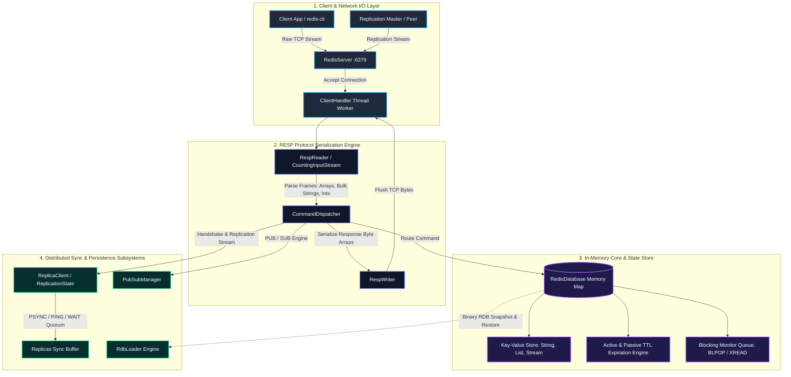

# Build Your Own Redis — Java

A complete, from-scratch Redis server implementation in Java, written to cover
the full [CodeCrafters "Build Your Own Redis"](https://codecrafters.io/challenges/redis)
progression: networking, the RESP protocol, strings & expiry, RDB loading,
lists & blocking commands, transactions, pub/sub, streams, and leader/replica
replication (including `WAIT`).

No external dependencies — pure JDK (17+), built with Maven.

## Project layout

```
redis-java/
├── pom.xml
└── src/main/java/redis/
    ├── Main.java                     entry point / arg parsing bootstrap
    ├── config/ServerConfig.java      CLI arg parsing, replication id/offset
    ├── protocol/
    │   ├── RespReader.java           RESP array/bulk-string parsing
    │   ├── RespWriter.java           RESP encoding (simple str, error, int, bulk, array)
    │   └── CountingInputStream.java  tracks bytes read (replica offset tracking)
    ├── core/
    │   ├── RedisDatabase.java        the keyspace: get/set/expire + blocking wait/notify
    │   ├── RedisValue.java           String/List/Stream value types
    │   └── StreamId.java             stream entry ID (ms-seq) parsing/comparison
    ├── rdb/
    │   ├── RdbLoader.java            parses RDB files (strings + expiry) into the DB
    │   └── EmptyRdb.java             canned empty RDB payload for FULLRESYNC
    ├── replication/
    │   ├── ReplicationState.java     master-side: replica list, propagate(), WAIT
    │   └── ReplicaClient.java        replica-side: handshake + apply master's stream
    ├── pubsub/PubSubManager.java     channel subscriptions + PUBLISH delivery
    ├── commands/CommandDispatcher.java   the command table (the bulk of the logic)
    └── server/
        ├── ServerContext.java        shared services bundle (db, config, repl, pubsub)
        ├── ClientContext.java        per-connection state (MULTI queue, subscriptions)
        ├── ClientHandler.java        per-connection thread; special-cases PSYNC
        └── RedisServer.java          accept loop
```

## Building

### Prerequisites

- JDK 17 or newer
- Maven 3.8+ (optional if compiling directly with `javac`)

```bash
cd redis-java
mvn -q package
```

This produces `target/redis-server.jar` with the main class already set.

If you don't have Maven, you can compile directly with `javac`:

```bash
find src -name '*.java' > sources.txt
javac -d out -encoding UTF-8 @sources.txt
```

## Running

```bash
# As a plain master on the default port (6379):
java -jar target/redis-server.jar

# Custom port, RDB dir/filename:
java -jar target/redis-server.jar --port 6380 --dir /tmp/redis-data --dbfilename dump.rdb

# As a replica:
java -jar target/redis-server.jar --port 6381 --replicaof "localhost 6380"
```

(If you compiled with plain `javac`, replace `java -jar target/redis-server.jar`
with `java -cp out redis.Main`.)

Talk to it with `redis-cli` or `nc`, same as a real Redis server:

```bash
redis-cli -p 6380 SET foo bar
redis-cli -p 6380 GET foo
```

## What's implemented, mapped to the challenge stages

| Stage area                         | Commands / behavior                                                      |
|-------------------------------------|----------------------------------------------------------------------------|
| Networking / concurrency            | TCP accept loop, one thread per client connection                        |
| RESP protocol                       | Arrays, bulk strings, simple strings, errors, integers; inline fallback  |
| Basic commands                      | `PING`, `ECHO`                                                            |
| Strings & expiry                    | `SET` (`PX`/`EX`/`NX`/`XX`/`GET`), `GET`, `DEL`, `EXISTS`, `TYPE`, `KEYS`, `INCR`, `EXPIRE`, `TTL`, `PTTL`, `PERSIST` |
| Config / introspection              | `CONFIG GET dir\|dbfilename`, `INFO replication`, `OBJECT ENCODING`, `COMMAND` |
| RDB persistence                     | Loads string keys + expiry from an RDB file at startup (`RdbLoader`)     |
| Lists                                | `RPUSH`, `LPUSH`, `LRANGE`, `LLEN`, `LPOP`, `RPOP`, blocking `BLPOP`      |
| Transactions                        | `MULTI`, `EXEC`, `DISCARD`, queuing, `EXECABORT` on bad queued command   |
| Pub/Sub                             | `SUBSCRIBE`, `UNSUBSCRIBE`, `PUBLISH`, subscribe-mode command gating     |
| Streams                             | `XADD` (`*`, `ms-*`, explicit IDs + ordering validation), `XRANGE`, blocking `XREAD` (incl. `$`) |
| Replication                         | `REPLICAOF`/`--replicaof`, handshake (`PING`→`REPLCONF`→`PSYNC`), `FULLRESYNC`, command propagation, `REPLCONF GETACK`/`ACK`, `WAIT` |

## Known limitations / simplifications

These are deliberate scope cuts that don't affect the core challenge flow,
called out so nothing is a surprise:

- **Full resync always sends an empty RDB.** The master doesn't serialize its
  live dataset into a real RDB snapshot for `PSYNC` — it sends the canonical
  empty RDB file, same as many minimal implementations. This means keys
  written to the master *before* a replica connects won't appear on that
  replica; keys written *after* it connects propagate correctly (this is
  covered by the replication tests, which write after connecting).
- **`RdbLoader` handles string values only.** List/hash/set/sorted-set typed
  values in an on-disk RDB file are skipped rather than reconstructed, since
  the challenge's RDB stages only require restoring string keys.
- **No RDB *saving*** (`SAVE`/`BGSAVE`) — only loading is implemented, since
  the challenge only asks you to read a pre-existing RDB file.
- **No keyspace-notification / `WATCH`** support for transactions (`WATCH` is
  accepted as a queued no-op if sent, but doesn't actually invalidate a
  transaction on key changes).
- **Single logical database** (`SELECT` is accepted but a no-op) — fine since
  the challenge doesn't exercise multiple databases.

All of the above are isolated to `RdbLoader`/`EmptyRdb`/replication full-sync
— straightforward to extend if you want to take this further.

## Testing it locally

A quick manual smoke test (everything below has been run against this exact
codebase):

```bash
# terminal 1
java -jar target/redis-server.jar --port 6390

# terminal 2
redis-cli -p 6390 SET foo bar
redis-cli -p 6390 GET foo
redis-cli -p 6390 RPUSH mylist a b c
redis-cli -p 6390 LRANGE mylist 0 -1
redis-cli -p 6390 XADD stream1 '*' field value
redis-cli -p 6390 XRANGE stream1 - +

# blocking pop, unblocked by a push from another connection
redis-cli -p 6390 BLPOP somekey 5 &
redis-cli -p 6390 RPUSH somekey hello

# transactions
redis-cli -p 6390 MULTI    # (use a single persistent -x session or pipe a script)

# replication (terminal 3)
java -jar target/redis-server.jar --port 6391 --replicaof "localhost 6390"
redis-cli -p 6390 SET replkey replvalue
redis-cli -p 6391 GET replkey     # => replvalue
redis-cli -p 6390 WAIT 1 1000     # => 1
```
## 🏛️ System Architecture


